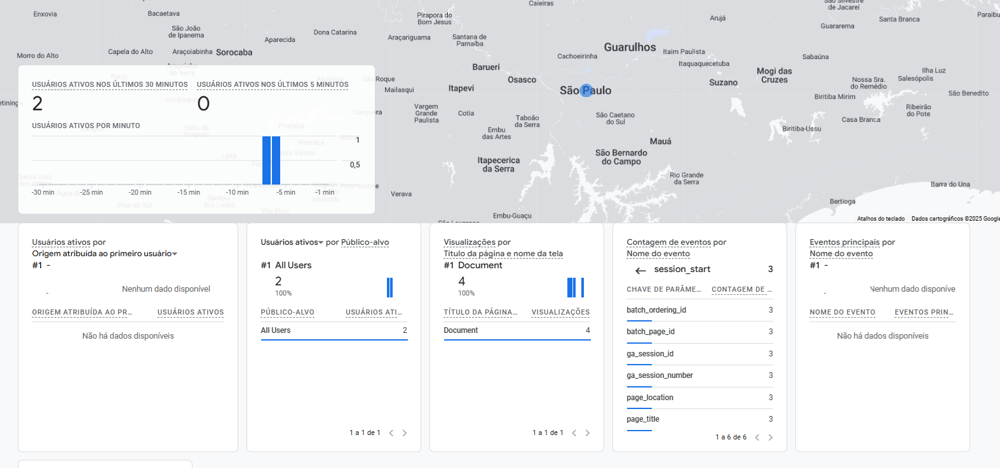

Prompts Manager (Community)

Prompts Manager é uma aplicação web moderna para organizar, editar e gerenciar prompts de forma eficiente. O projeto foi desenhado para ser intuitivo, responsivo e fácil de usar, inspirado em interfaces profissionais e minimalistas.

🔗Acesse o link para ver o resultado: https://victor-mt.github.io/nlw-prompts-manager/

## Funcionalidades

- Sidebar com busca de prompts e botão para criar novos
- Listagem de prompts com título, descrição e opção de remover
- Edição de título e conteúdo do prompt principal
- Interface responsiva e visual limpo
- Ícones SVG otimizados para ações rápidas

## Tecnologias Utilizadas

- HTML5 sem frameworks
- CSS3 com variáveis e classes customizadas
- JavaScript puro para interatividade (localstorage para salvar dados básicos)
- SVGs customizados para ícones
- Google Fonts (Inter)
- Utilização do MCP do Figma integrado com o GitCopilot

Além disso, foi adicionado ao projeto original um sistema de rastreamento de interações com o site por meio do Google Analytics:


## Estrutura do Projeto

```
├── index.html         # Estrutura principal da aplicação
├── style.css          # Estilos globais e componentes
├── script.js          # Lógica de interação e manipulação DOM
├── assets/            # Ícones SVG e imagens
│   ├── collapse.svg
│   ├── copy.svg
│   ├── favicon.svg
│   ├── logo.svg
│   ├── open.svg
│   ├── remove.svg
│   ├── search.svg
└── README.md          # Documentação do projeto
```

## Como rodar o projeto

1. Clone o repositório:
   ```sh
   git clone https://github.com/seu-usuario/prompts_manager.git
   ```
2. Abra o diretório no VS Code ou outro editor de sua preferência
3. Basta abrir o arquivo `index.html` em seu navegador

## Como contribuir

- Fork o projeto
- Crie uma branch para sua feature ou correção
- Faça o commit e abra um Pull Request

## Contato

Dúvidas, sugestões ou oportunidades? Fique à vontade para abrir uma issue ou entrar em contato pelo GitHub!

---

Este projeto é ideal para quem busca exemplos de código limpo, organização de UI e boas práticas em projetos front-end sem dependências externas.

## Observações técnicas

- Este projeto foi construído utilizando o MCP do Figma, como forma de testar a integração de Inteligência Artificial no fluxo de trabalho e obter ganhos reais de produtividade no desenvolvimento front-end.
- O JavaScript da aplicação utiliza o conceito de localStorage para persistir dados dos prompts, permitindo que o usuário mantenha suas informações salvas mesmo após fechar o navegador.


